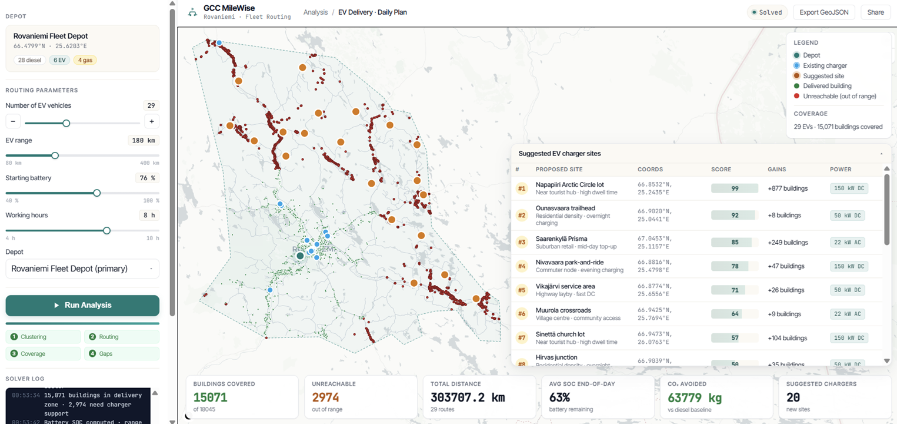

# GCC MileWise — Rovaniemi EV Fleet Routing

## Introduction

Public and private stakeholders across Finland are responsible for delivering essential services and goods to every building within their administrative units — at least once per day. This is a demanding logistical challenge in a country where municipalities can span hundreds of kilometres, and where seasonal conditions vary dramatically between summer and winter.

Winter conditions in Finland are particularly critical for electric vehicle (EV) operations. Cold temperatures can reduce battery capacity by 20–40%, meaning that a vehicle with a rated range of 220 km may only achieve 130–180 km in midwinter. Despite this, most delivery fleets today rely heavily on diesel vehicles, which continue to emit greenhouse gases and contribute to Finland's carbon footprint.

---

## Objective

Develop an interactive planning tool that helps stakeholders simulate and evaluate scenarios for transitioning last-mile delivery operations to fully electric fleets, with the goal of achieving net-zero carbon emissions. The tool should allow decision-makers to explore how fleet size, vehicle range, battery state, and working hours affect delivery coverage — and where new EV charging infrastructure should be built to close the gaps.

---

## Problem

Finnish municipalities are under increasing pressure to decarbonise their operations. Delivery fleets are one of the largest sources of local emissions, yet the transition to EVs is complicated by two key constraints:

1. **Coverage obligation.** Stakeholders must reach every building in their administrative unit at least once per day. In Rovaniemi, this means tens of thousands of delivery points spread across an area that extends over 80 km from the main depot.

2. **Charging infrastructure gaps.** The current EV charging network is concentrated around the city centre. Buildings in rural and suburban areas lie beyond the operational range of a single EV shift, making full electrification impossible without new charging stations.

The result is a dependency on diesel vehicles for outlying routes — preventing any meaningful progress towards carbon neutrality.

---

## Solution

GCC MileWise is a browser-based interactive planning tool built on real geospatial data for Rovaniemi municipality. It models EV fleet operations and visualises delivery coverage on a live map, enabling stakeholders to test different scenarios without any technical expertise.

*MileWise Fleet Router*

### How the algorithm works

**Coverage modelling.** The tool calculates a *coverage radius* around the depot — the area within which an EV can complete deliveries and return within a single shift. This radius is directly influenced by four parameters the user can adjust:

- **Number of EV vehicles** — more vehicles cover a wider geographic area by dividing the municipality into sectors.
- **EV range** — a longer battery range extends how far each vehicle can travel.
- **Starting battery level** — a lower starting charge reduces the effective range, simulating partially charged fleets or winter battery degradation.
- **Working hours** — longer operational shifts allow vehicles to cover more ground.

All four parameters are proportional: increasing any one of them expands the green delivery zone on the map.

**Delivery zone visualisation.** Buildings within the coverage radius are shown in green (reachable), while those outside are shown in red (unreachable). This immediately communicates to users which areas can be served by the current fleet configuration.

**Suggested charging stations.** For buildings that remain unreachable, the algorithm identifies where new EV charging stations should be built. It uses a greedy spatial algorithm that:
- Places each new charger on a main road or highway (not on residential dead-ends),
- Ensures chargers are located near clusters of unreachable buildings,
- Avoids placing chargers too close to existing infrastructure,
- Chains chargers in sequence so EVs can reach far outlying areas hop by hop.

The result is a ranked list of suggested sites, each showing how many currently unreachable buildings it would unlock.

**Road-aware placement.** Charger suggestions are snapped to road intersections with high connectivity — a proxy for major roads and arterial routes — so that suggested sites are practical and accessible.

### Reliability for users

The tool runs entirely in the browser using real OpenStreetMap road data and building footprints for Rovaniemi. No server is required. Results update interactively as users move the sliders, making it a practical demonstration tool for stakeholder meetings, planning sessions, or public consultations.

---

## Future Development

The current prototype is scoped to Rovaniemi municipality as a proof of concept. The underlying approach is fully scalable:

- **National deployment.** With cloud computing infrastructure, the same algorithm can be applied to all Finnish municipalities simultaneously, generating fleet and charging station plans for the entire country. Cloud-based processing would handle the larger road networks and building datasets involved.
- **Seasonal scenarios.** Winter battery degradation can be modelled explicitly by adjusting the range parameter per season, enabling planners to design fleets that remain viable year-round.
- **Fleet mix optimisation.** Future versions could model mixed fleets (diesel + EV) and find the optimal transition path that minimises emissions while maintaining full coverage.
- **Real-time integration.** Integration with live fleet telematics and charging network APIs would allow the tool to move from planning to operational decision support.

---

## Reference

Vallejo, B., Kähärä, T., Nugroho, A. (2026). Geospatial Challenge Camp. *"Energy-efficient last mile delivery"*

---

## Technical notes

- **Architecture:** static single-page app — no backend required. All computation runs in the browser via JavaScript.
- **Data:** OpenStreetMap road network and building footprints for Rovaniemi, pre-processed from parquet files.
- **Map:** MapLibre GL JS with CARTO Positron basemap.
- **Deployment:** GitHub Pages (see `DEPLOY.md`).
